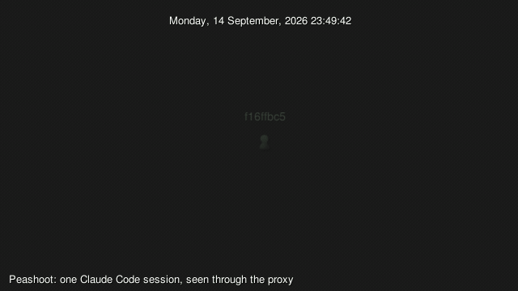

# Peashoot

A language-agnostic record/replay and stream-resume proxy for LLM agent traffic, with a farm dashboard. Kotlin, Ktor, Compose for Desktop.



One Claude Code session reading and editing this repository through the proxy, played back by Gource from a log the proxy wrote. Peashoot sees that much because it sits on the wire rather than in a client's hooks, which is why the same picture is available to Codex, to OpenCode, and to a plain SDK script that has no hooks at all. [How to make your own](#watch-agents-move-through-the-repository).

Status: pre-v1. The spec is `docs/spec.md`, the design `docs/design.md`, the plan is the issue tracker.

## Build

```
./gradlew build
```

JDK 21+. The build treats every compiler warning as an error, checks formatting with ktfmt (Kotlin language style, no options), runs detekt's default rules and an ArchUnit boundary test, and runs the tests under `check`. `./gradlew koverHtmlReport` writes a coverage report to `build/kover/html`.

## Quickstart

Build the proxy and start it:

```
./gradlew :proxy:installDist
proxy/build/install/proxy/bin/proxy
```

It listens on `http://localhost:8787` and routes by path, so one address serves every client: `/v1/messages` is the Anthropic Messages surface, `/v1/responses` and `/v1/chat/completions` the two OpenAI ones. `GET /v1/models` belongs to neither and is passed through to whichever provider the sender's own headers name.

Then set one thing in the client you actually use. The four below are independent; read yours and skip the rest.

### Claude Code

```
ANTHROPIC_BASE_URL=http://localhost:8787 claude
```

One variable, and a saved claude.ai login keeps working: subscription traffic carries its OAuth capability in `anthropic-beta`, and the proxy forwards request headers verbatim apart from the hop-by-hop ones and the secret ones.

What to expect: one `exchange.started` and one `exchange.completed` line per request in `~/.peashoot/events.jsonl`, with `"client":"claude-code"`, `"surface":"anthropic-messages"`, and a `"session"` taken from Claude Code's own `x-claude-code-session-id`, so a whole session groups without anything reading a prompt. A sub-agent's turns carry `"agent"` and `"parentAgent"` beside it. [Live events from a Claude Code session](#live-events-from-a-claude-code-session) is the same run with the app open, and [Replay: the second run costs nothing](#replay-the-second-run-costs-nothing) is the same prompt twice for one bill.

### Codex

Codex speaks the Responses API and nothing else, and there is no base-URL environment variable for it — it is a config key, in `~/.codex/config.toml`:

```toml
model_provider = "peashoot"

[model_providers.peashoot]
name = "OpenAI through Peashoot"
base_url = "http://localhost:8787/v1"
env_key = "OPENAI_API_KEY"
wire_api = "responses"
```

Leave `supports_websockets` unset: it defaults to false for a custom provider, so Codex goes straight to HTTP. Set it to `true` to exercise the proxy's `426 Upgrade Required` deliberately — the turn should still complete, a beat later. A project-local `.codex/config.toml` cannot set any of these keys.

What to expect: `"surface":"openai-responses"`, `"client":"codex"`, a `"session"` from Codex's own `session-id` header, and a `"tools"` array naming each function call. **Nobody has run this yet** — [A Codex turn through the proxy](#a-codex-turn-through-the-proxy) is the walkthrough for whoever does it first, down to what a `/review` or `/compact` thread should look like on the event line.

### OpenCode

Every OpenCode provider is a Vercel AI SDK package and every one of them takes a `baseURL`, so this is a config change and nothing more. In `opencode.json`:

```json
{
  "$schema": "https://opencode.ai/config.json",
  "provider": { "anthropic": { "options": { "baseURL": "http://localhost:8787/v1" } } }
}
```

What config cannot say is which OpenCode *session* a request belongs to. A `chat.headers` plugin — a three-line hook, in a file of seven once it has its import and its export — sets `x-peashoot-session`, which the proxy honours over every other signal, keeps out of the fingerprint, and strips before the request goes upstream.

**Nobody has run this yet either: no OpenCode binary has been pointed at Peashoot.** Everything above is read from OpenCode's own documentation and source. The plugin, the OpenAI-compatible provider, and the smoke run that is owed to a human with a key are in [`docs/opencode.md`](docs/opencode.md).

### The Anthropic and OpenAI SDKs

A base URL is the whole story. The Anthropic SDKs take the host and append `/v1/messages` themselves; the OpenAI SDKs take the host and `/v1`, and append `/responses` or `/chat/completions`.

| SDK | What to set |
|---|---|
| Anthropic Python | `Anthropic(base_url="http://localhost:8787")`, or `ANTHROPIC_BASE_URL` |
| Anthropic TypeScript | `ANTHROPIC_BASE_URL=http://localhost:8787` |
| OpenAI Python | `OpenAI(base_url="http://localhost:8787/v1")`, or `OPENAI_BASE_URL` |
| OpenAI Node | `new OpenAI({ baseURL: "http://localhost:8787/v1" })` |

What to expect: the official SDKs all send `x-stainless-*` headers, so `"client"` on the event line reads `sdk-` and whatever `x-stainless-lang` says — `sdk-python`, `sdk-js`. None of them sends a session id of its own, so turns group by a hash of the conversation's first user message, which is stable for as long as that message is. To group them yourself, send `x-peashoot-session` as a default header: it wins over every other signal, is no part of the fingerprint, so a recording made in one session replays in another, and is stripped before the request leaves the proxy.

Replay works the same way it does for every other client here, and it is the point of pointing a script at Peashoot at all: record the run once, then flip the route to `replay` and re-run the suite for nothing. `docs/research/client-compat-matrix.md` §2.8 is where these base-URL knobs are cited.

## Configuration

The data directory holds `peashoot.db` (the store), `bodies/` (request bodies and frame lists over 64 KB, named by SHA-256), `gource.log` (written only when the Gource formatter is on), `rules.json` (what makes two requests the same request: a header allowlist, ignored JSON pointers, and regex replacements, written with defaults on first start and meant to be edited; reducing it to `{}` is exact matching), `redact.json` (what a cassette export strips, see below), `cassettes/` (exported cassettes), `token` (the control API's bearer token, created on first start, readable by its owner only), and `peashoot.toml`, written with defaults on first start: port, host, an upstream per surface (`[surfaces.anthropic]` and `[surfaces.openai]`, so pointing the OpenAI traffic at a local OpenAI-compatible server does not drag the Anthropic traffic along with it), secret headers, the Gource flag, the keep-alive ping interval, the mode of each route (`record`, `replay`, or `passthrough`), whether a replay miss on it is refused (`strict`), and the cassette it replays from (`cassette`), and the replay `cadence` and `repeatPolicy`. Environment variables override the file:

| Variable | Default | Meaning |
|---|---|---|
| `PEASHOOT_HOME` | `~/.peashoot` | The data directory |
| `PEASHOOT_PORT` | `8787` | Listen port, loopback only; `0` takes a free one and logs it |
| `PEASHOOT_HOST` | `127.0.0.1` | Listen address; anything that is not loopback is refused |
| `PEASHOOT_ANTHROPIC_UPSTREAM` | `https://api.anthropic.com` | Where Messages requests go |
| `PEASHOOT_MODE` | `record` | The default route's mode: `record`, `replay`, or `passthrough` |
| `PEASHOOT_STRICT` | `false` | `true` refuses a replay miss with 409 |
| `PEASHOOT_CASSETTE` | unset | A cassette file, imported on start under its base name, which the default route then replays from |
| `PEASHOOT_DUMP_FRAMES` | unset | Append every raw upstream response to this file, for capturing fixtures |

An invalid value stops the proxy with a message naming the variable. There is deliberately no variable for the OpenAI upstream: nothing in CI points at one, so `[surfaces.openai] upstream` in the file and `PUT /config` are the two ways to move it.

The database schema is created if absent and never altered before v1. A `peashoot.db` made before cassettes (#13) lacks the `cassette` column, and the proxy refuses to open it: move it aside and a fresh one is created.

## Control API

The proxy's own port serves a control API under `/_peashoot/v1/`; nothing under `/_peashoot/` is ever relayed. Every call but `GET /health` needs the token from the data directory:

```
TOKEN=$(cat ~/.peashoot/token)
curl http://localhost:8787/_peashoot/v1/health
curl -N -H "Authorization: Bearer $TOKEN" "http://localhost:8787/_peashoot/v1/events?since=0"
curl -H "Authorization: Bearer $TOKEN" "http://localhost:8787/_peashoot/v1/exchanges?client=claude-code&limit=10"
curl -X PUT -H "Authorization: Bearer $TOKEN" -d '{"mode":"replay","strict":true}' \
  http://localhost:8787/_peashoot/v1/routes/default
curl -X POST -H "Authorization: Bearer $TOKEN" -d "{\"rules\":$(cat rules.json),\"lastN\":50}" \
  http://localhost:8787/_peashoot/v1/rules/test
curl -X POST -H "Authorization: Bearer $TOKEN" -d '{"name":"nightly"}' \
  "http://localhost:8787/_peashoot/v1/cassettes/export?dryRun=true"
```

`/events` is a server-sent event feed of the event lines, each with its id; `Last-Event-ID`, or `since` when the header is absent, backfills what came after that id. A reader that falls far behind is cut off and picks up where it left off when it reconnects. `/exchanges` pages newest first with `cursor` and filters by `session` and `client`; `/exchanges/{id}?frames=true` adds the frames. `/sessions` is the spend per session and agent. `/routes` shows each route, and a `PUT` changes one for the next request without a restart; the change is held in memory, so a restart goes back to `peashoot.toml` and the environment. Errors are `application/problem+json` objects with `type`, `title`, `detail`, and `status`.

`/rules` serves and replaces `rules.json`, validated the way the start validates it, and the new rules fingerprint the next request without a restart. `POST /rules/test` answers what a candidate rule set would do to the last N recordings before you save it: `collisions` are exchanges that would share a fingerprint and do not now, `splits` are exchanges that share one now and would not. `/cassettes` lists what is in `cassettes/` and what the store has imported, and `POST /cassettes/export` (with `?dryRun=true` for the redaction preview alone) and `POST /cassettes/import` are the CLI's export and import over HTTP. `GET /config` is the running config, never the token; `PUT /config` replaces the keys it names, leaf by leaf, rewrites `peashoot.toml`, applies the routes and the upstream to the next request, and lists the rest as `restartRequired` — `port`, `host`, `secretHeaders`, `replay`, `resume`, `gource`, and `pricing` are read once at start. `secretHeaders` is on that list on purpose: a running proxy keeps dropping the headers it started with, so no call can make it store a credential. Anything an environment variable overrides comes back as `environmentWins`, because a restart will not pick that key up from the file either. `POST /shutdown` answers, then stops the proxy.

## The app

A Compose for Desktop window over the control API, in three tabs. **farm** is the point: one villager per session, walking to the well for each request and carrying its tokens home, with the shipping bin's ledger beside them; clicking a villager opens the plain timeline of its exchanges, and clicking a crop opens that file's touch history. Paths and commands are hidden by default, and turning them on draws a badge on the canvas, so a screenshot cannot leak one by accident. **events** is the same feed as a flat list of lines, which is how you check the farm against the data. **control** is what to do about what they say: the route modes, the rules editor with its test-before-save view, the cassette export with its redaction preview, and the running config.

```
./gradlew :proxy:fatJar    # the jar the app starts when nothing answers
./gradlew :app:run
```

It reads the bearer token from the data directory (`PEASHOOT_HOME`, else `~/.peashoot`) and talks to `http://127.0.0.1:8787`, or to `PEASHOOT_PORT` when that is set. It speaks HTTP only and never opens the database.

With nothing answering on the port, the app starts a proxy itself, on the same port it is looking at, and where it looks depends on how it was installed. An **installed** app looks in exactly one place: `peashoot.jar` under its own packaged resources, which the installers put there. It looks nowhere else on purpose — the development paths below are relative to the working directory, which for an installed app is whatever happened to launch it, a shortcut or a shell or a file manager, and a `peashoot.jar` planted under one of those by anyone who could write there would then run with the app's privileges. A **development** build, where there are no packaged resources, takes `proxy/build/libs/peashoot.jar` or the same path one directory up, so the app runs from the repository root or from `app/`; failing that it takes the `installDist` launcher, `proxy/build/install/proxy/bin/proxy`. The jar comes first because it is one process rather than a script wrapping a JVM, and only a jar whose manifest names a main class counts.

The child is given `PEASHOOT_HOME` and the port, so it cannot bind a different one. A proxy the app started is stopped when the window closes, and by a shutdown hook if the window never gets the chance — script and JVM both, since killing only what was started would leave a proxy holding the port. One that was already running is left alone, and so is a port held by anything else, since a second proxy could not bind it anyway. When there is nothing to start, the window says so and names every place it looked, instead of waiting.

The feed reconnects with `Last-Event-ID`, waiting 250 ms and doubling to five seconds, so a dropped connection, a restarted proxy, or a killed one costs no event lines and repeats none: it resumes from the last line it actually showed you. A token the proxy refuses ends the feed with the reason on screen rather than retrying forever.

### Live events from a Claude Code session

1. `./gradlew :proxy:fatJar`, then `./gradlew :app:run`, and wait for `connected to http://127.0.0.1:8787` at the top of the window.
2. In another terminal, point Claude Code at the proxy:

   ```
   ANTHROPIC_BASE_URL=http://localhost:8787 claude -p "Name three vegetables that grow well in shade."
   ```

3. Lines appear at the top of the list while the request runs: `exchange.started` when the request is heard and `exchange.completed` when the answer ends, each with its feed id, its timestamp, and its exchange id. The uptime beside the version keeps ticking.
4. With the window still open, stop the proxy and start it again — `Ctrl-C` it, or kill it outright, either works. The status line goes to `no proxy at http://127.0.0.1:8787` and then back to `connected`, and the ids carry on from where they stopped: nothing that happened in between is missing, and nothing you had already seen comes back a second time.

### The farm with no API key at all

The farm is fed by event lines, and a replay makes event lines without calling anyone. Start the proxy yourself first, in replay mode against the committed cassette and with the upstream pointed at a port nothing listens on so that a miss could not become a bill — the app would otherwise start one of its own, in record mode. Then open the app, and send the same recorded request under a few different session ids:

```
PEASHOOT_MODE=replay PEASHOOT_STRICT=true \
  PEASHOOT_CASSETTE=examples/ci-replay/tool-use.jsonl \
  PEASHOOT_ANTHROPIC_UPSTREAM=http://127.0.0.1:9 proxy/build/install/proxy/bin/proxy

for s in ada bram cleo dusty; do
  for _ in 1 2 3; do
    curl -s -o /dev/null -H 'content-type: application/json' -H "x-peashoot-session: $s" \
      --data-binary @examples/ci-replay/request.json http://localhost:8787/v1/messages
  done
done
```

The session header is no part of the fingerprint, so all twelve requests hit the same recording: twelve `"replayHit":true` lines, four sessions, `"costUsd":0.0` throughout, and four villagers. This cassette's one tool call is a `Bash` that names no file, so nothing is planted and no crop grows — for fields you need traffic that reads or edits something.

### Installers and the jar

`./gradlew build` leaves the proxy as one runnable file, `proxy/build/libs/peashoot.jar`: `java -jar` it anywhere Java 21 runs, no script and no install directory. `bash examples/jar-boot/boot.sh` starts that jar and asks it who it is, which is the one check that would catch a jar that lost its main class or its version.

```
./gradlew :app:createDistributable
```

writes a runnable application image to `app/build/compose/binaries/main/app/`, carrying `peashoot.jar` as an app resource and a runtime image able to start it. `packageMsi`, `packageDmg`, and `packageDeb` build installers from it.

Pushing a `v*` tag builds those three and opens a **draft** release with them and the jar attached; publishing stays a human act, and nothing in the workflow ever makes a release visible. The installers are **unsigned**, so Windows SmartScreen and macOS Gatekeeper will warn about them and a macOS user needs right-click Open the first time. The DMG is Apple Silicon only, because jpackage builds for the machine it runs on. What has actually been tried is the Windows path: the image starts the bundled jar on the bundled runtime and leaves nothing behind, and the MSI builds. The macOS and Linux installers, and the tag itself, are the owner's to prove.

`examples/live-smoke/smoke.sh` is the one thing here that spends money: one tiny prompt per provider against the real APIs, then the same requests again in replay mode with every upstream pointed at a port nothing listens on. It is manual, it skips a provider whose key is not set, and it is what would catch a provider renaming a field out from under the grammars.

## Replay: the second run costs nothing

A route in `replay` mode answers every request it has a recording for straight from the store, with the recorded status, headers, and frames, byte for byte, and never calls the provider. Two requests are the same request when `rules.json` gives them the same fingerprint. In `peashoot.toml`:

```
[routes.default]
mode = "replay"
strict = true      # a miss is a 409 naming the fingerprint; false asks the provider and records the answer

[replay]
cadence = "instant"        # or "recorded": each frame waits for the offset it arrived at
repeatPolicy = "inOrder"   # or "latest"
```

With `inOrder`, a request recorded three times replays its three responses in the order they happened, then repeats the last; the count starts over when the proxy restarts. `latest` always serves the newest. A strict miss answers `409` with `{"type":"peashoot_error","error":"replay_miss","fingerprint":"...","route":"default"}`. A lenient miss goes to the provider, and the answer is recorded, so the next identical request hits.

The demo: one Claude Code prompt, run twice. The first run records and is billed; the second replays and is not. Pick a prompt that uses no tools, so the second run sends exactly the request the first one did.

1. Start the proxy in record mode (the default) and run the prompt:

   ```
   proxy/build/install/proxy/bin/proxy
   ANTHROPIC_BASE_URL=http://localhost:8787 claude -p "Name three vegetables that grow well in shade."
   ```

2. Stop the proxy, set `mode = "replay"` and `strict = true` under `[routes.default]` in `~/.peashoot/peashoot.toml`, and start it again with the provider pointed at a port nothing listens on, so any request that got past the replay would fail instead of being billed:

   ```
   PEASHOOT_ANTHROPIC_UPSTREAM=http://127.0.0.1:9 proxy/build/install/proxy/bin/proxy
   ANTHROPIC_BASE_URL=http://localhost:8787 claude -p "Name three vegetables that grow well in shade."
   ```

   The same answer comes back. Every `exchange.completed` line this run added to `~/.peashoot/events.jsonl` says `"replayHit":true` and `"costUsd":0.0`:

   ```
   grep '"exchange.completed"' ~/.peashoot/events.jsonl | tail -n 5
   ```

   Claude Code can send more than one request for one prompt; each was recorded in step 1 and replays the same way. A request that differs between the runs gets the 409 instead, and its fingerprint is in the body, so the rule that should have ignored the difference can be found in `rules.json`.

## A Codex turn through the proxy

Codex speaks the Responses API and nothing else, and it opens every session by trying a WebSocket
upgrade before it sends any HTTP at all. The proxy answers that upgrade `426 Upgrade Required`, which
is the one status Codex reads as "this provider speaks HTTP" and falls back on immediately; anything
else costs it five retries first (`docs/research/codex-responses-transport.md`).

**Nobody has run this yet.** The Responses surface is proven at the proxy's HTTP boundary against
synthetic fixtures, and the upgrade refusal is verified against Codex's source, but no Codex binary
has been pointed at Peashoot. These are the steps for the human who does it first (#25, acceptance
criterion 1). Start the proxy and write the `~/.codex/config.toml` from [the Codex
quickstart](#codex) above, then:

1. Run one turn that uses a tool, so the function-call grammar is exercised and not just text:

   ```
   codex exec "Run the shell tool: echo peashoot"
   ```

2. Look at what the proxy heard. The turn is one `exchange.completed` line per request:

   ```
   grep '"exchange.completed"' ~/.peashoot/events.jsonl | tail -n 5
   ```

   What should be there: `"surface":"openai-responses"`, `"client":"codex"`, a `"session"` taken from
   Codex's own `session-id` header, and a `"tools"` array naming the shell call with its `command`.
   A `review` or `compact` thread appears as its own `"agent"` beside the same session. If `client`
   reads anything but `codex`, the originator header has changed and `Client.detect` needs to know.

3. Run a `/review` or a `/compact` in the same session, which is the one step here that exercises
   something nothing else can reach. Those spawn a second thread, and only they send
   `x-openai-subagent` and `x-codex-parent-thread-id` — the two header names
   `docs/research/codex-responses-transport.md` marks as read from Codex's source without a quoted
   line, and the two the farm's agent graph rests on. On the event line, the lines for that thread
   should carry an `"agent"` different from the main thread's and a `"parentAgent"` naming the
   thread it came from, while `"session"` stays the same as the main thread's:

   ```
   grep '"exchange.completed"' ~/.peashoot/events.jsonl | tail -n 5
   ```

   If `agent` and `parentAgent` are both `null` on those lines, one or both header names are wrong
   and `Client.detect` needs correcting — the farm would draw that thread as its own session rather
   than as a helper beside its parent. Say so on #25 if you see it.

4. Replay it and spend nothing. Stop the proxy, start it again with `PEASHOOT_MODE=replay`, and run
   **the identical prompt**. Every line the second run adds says `"replayHit":true`. A chained turn
   replays too, and needs no id rewriting: the recorded response id is served back verbatim, so the
   `previous_response_id` Codex sends on the next call is the one the recording already knows.

To capture fixtures from this run rather than just watching it, use `PEASHOOT_DUMP_FRAMES` and the
redaction recipe in `core/src/test/resources/openai-responses/README.md`.

## Cassettes: replay in CI without a key

A cassette is a JSONL file with one recorded exchange per line, meant to be committed. Export what the store holds, and import it anywhere:

```
proxy/build/install/proxy/bin/proxy export nightly --dry-run    # list what redaction would strip; writes nothing
proxy/build/install/proxy/bin/proxy export nightly              # writes ~/.peashoot/cassettes/nightly.jsonl
proxy/build/install/proxy/bin/proxy export nightly --session 3f9c...   # only one session's exchanges
proxy/build/install/proxy/bin/proxy import nightly.jsonl        # tagged "nightly", replacing what that name held
```

Export applies `redact.json`, a list of `{"pointer", "pattern", "replacement"}` rules in the shape of `rules.json`'s `replace`. A pointer names strings in the request body; the empty pointer names every string in the request body and the response text too. The default replaces anything shaped like an API key (`sk-ant-…`, `sk-…`) with `[REDACTED]`. The dry run prints one line per hit: the exchange id, where, what matched (masked to its first characters and length, since the output can land in CI logs), and what it becomes. Export takes live recordings only, never a cassette the home imported. Import drops secret headers too, and needs a file whose base name is a usable cassette name. The request's fingerprint is exported as recorded, so a redacted request still replays. Authorization headers and API keys are never in the store, and export drops the secret headers again by name.

`[routes.default]` with `cassette = "nightly"` replays only what that cassette holds. A CI job needs no config file:

```
PEASHOOT_MODE=replay PEASHOOT_STRICT=true PEASHOOT_CASSETTE=cassettes/nightly.jsonl proxy/build/install/proxy/bin/proxy
```

`examples/ci-replay/` is a working example that the `Replay demo` workflow runs on every pull request and every push to `main`: `replay.sh` starts the proxy that way, with an upstream nothing listens on, sends `request.json`, checks the replayed stream, and checks that an unrecorded request gets 409. Run it locally after `./gradlew :proxy:installDist`:

```
bash examples/ci-replay/replay.sh
```

## Keep-alive pings and a client that leaves

While a streaming response is silent, the proxy writes the SSE comment line `: keep-alive` followed by a blank line, at the interval set by `pingIntervalSeconds` in the `[resume]` table of `peashoot.toml` (default 15 seconds, fractions allowed). The comment never reaches the recording; SSE clients ignore comment lines by specification. Non-streaming responses never get one.

If a client disconnects mid-stream, the proxy keeps reading the upstream to the end, records the exchange complete with `clientDisconnected` set, and appends an `exchange.client_gone` line to `events.jsonl`. `exchange.completed` still follows, with `clientDisconnected: true`.

Manual check, with a real key. The seam test stalls a fake upstream for several intervals; the real API cannot be made to stall on demand, because it sends `event: ping` frames of its own, so what a human checks here is that Claude Code and its SDK take the proxy's lines in their stride. Set `pingIntervalSeconds = 0.2`, start the proxy, then send a streaming Messages request through it with a prompt that makes the model think for a while:

```
$ curl -N http://localhost:8787/v1/messages \
  -H "x-api-key: $ANTHROPIC_API_KEY" -H "anthropic-version: 2023-06-01" -H "content-type: application/json" \
  -d '{"model":"claude-sonnet-4-5","max_tokens":20000,"stream":true,"thinking":{"type":"enabled","budget_tokens":16000},"messages":[{"role":"user","content":"Solve a hard logic puzzle, showing your reasoning."}]}'
```

The pauses in a thinking stream are longer than that interval, so `: keep-alive` lines appear between the provider's frames. The provider's own `event: ping` frames are forwarded, not generated, so the proxy's lines are the ones that start with a colon. Then run Claude Code against the proxy with the same kind of prompt: the turn completes, and `events.jsonl` ends with an `exchange.completed` line for it, no `exchange.client_gone`.

## Stream-resume: lose the connection mid-answer and pay once

A client that leaves mid-answer and asks again is served the answer the proxy went on reading, from its first frame, live if the provider is still streaming. No second provider call is made, so the half-finished answer is not thrown away and the second ask is not billed. In `peashoot.toml`:

```
[resume]
windowSeconds = 300          # how long a dropped answer stays resumable; 0 turns resume off
maxBufferedExchanges = 100   # how many are kept at once, the oldest dropped first
```

Only an exchange whose client actually went away is resumable: two identical requests from two clients that are both still there are a user asking twice, and each is owed its own sample. One drop buys one resume, so a second re-issue goes to the provider. On Messages the re-issue does not have to be byte-identical — Claude Code appends a line to its last user message and a short "carry on" block, and that still matches (`docs/adr/0002-resume-continuation-match.md`).

The demo: start an answer, cut the connection, let the client ask again, and read the two event lines.

1. Start the proxy in record mode (the default) and send Claude Code a prompt long enough to still be streaming when you cut it:

   ```
   proxy/build/install/proxy/bin/proxy
   ANTHROPIC_BASE_URL=http://localhost:8787 claude -p "Count from 1 to 300, one number per line."
   ```

2. While the numbers are still printing, take the network away: sleep the laptop and wake it, or turn Wi-Fi off and on, or pull the cable. Claude Code notices the stream stop and re-issues within about 30 ms of the connection closing.

3. What you see: the answer completes. Not from where it stopped — from the beginning, because the client threw its partial output away and the proxy has the whole original.

4. What proves nothing was re-billed, in `~/.peashoot/events.jsonl`:

   ```
   grep -E '"exchange.(completed|client_gone)"' ~/.peashoot/events.jsonl | tail -n 3
   ```

   Three lines tell the story. The `exchange.client_gone` line names the exchange whose client went and how many bytes it had taken. Its `exchange.completed` line says `"clientDisconnected":true` and carries the provider's `usage` — that call happened and was billed. The next `exchange.completed` line says `"resumed":true`, `"clientDisconnected":false` and `"costUsd":0.0`, with the same `usage` read back out of the same frames: a second answer delivered, and nothing billed for it, exactly as `"replayHit":true` reads on a replay. Two answers, one bill.

   `usage` is the honest field to read here, not `costUsd`. On the saved claude.ai login the original's `costUsd` is `null`, because subscription traffic is billed by the plan and not by the token, so the two lines for the one call are priced by different rules: `null` for "we cannot say", `0.0` for "there was nothing to say it about". With an API key the original carries a figure and the contrast is direct.

   `~/.peashoot/peashoot.db` holds **one** row for the two of them: the original, flagged as the one whose client left, which is the single record of the single provider call. The resumed answer is not recorded, exactly as a replay hit is not — it made no call, and a second row under one fingerprint would be replayed twice and exported twice. The `resumed` flag lives on the event line alone, so `events.jsonl` is where that question is asked.

**This demo is written down and has not yet been performed.** What is proven is the seam: `ResumeSeamTest`, `ResumeMatchTest` and `ResumeBoundsTest` run real servers against the fake upstream and assert the whole of it — byte-equal streams across the hand-over, one upstream call, the flags and the cost on the event lines, the window and the cap evicting. What the spike behind this (`docs/research/claude-code-stream-drop-retry.md`) measured against the real provider was an abrupt reset mid-stream and a clean close before the first byte, on one client version, one OS, one model, and a prompt with no tool use. It did **not** establish the laptop-sleep case itself: a connection that goes silent without closing looks open to the proxy until a write to it fails, and what ends it is Claude Code's own byte watchdog rather than anything on this side of the socket. Nor did it establish a drop on a turn that had already produced a `tool_use` block, or what a client does when it is cut a second time. Pulling the cable is the closer of the two to what was measured; sleeping the laptop is the case worth watching and the one still unproven.

## Watch agents move through the repository

The picture at the top of this file is one Claude Code session through the proxy, played back by Gource from the log this section describes. Turn the Gource formatter on in `peashoot.toml`:

```
[gource]
enabled = true
```

The proxy then appends one line to `gource.log` for every file tool a turn used. A line carries the timestamp, the session short id as the user, `A` for a read and `M` for an edit, the file, and a colour per tool. A tool that names no file, like `Bash`, is skipped. Play the log back, or watch a run live:

```
gource --log-format custom ~/.peashoot/gource.log
tail -f ~/.peashoot/gource.log | gource --log-format custom --realtime -
```

Claude Code names files by their absolute path, so the tree starts at the drive root. Trim the repository's prefix to start it at the repository instead:

```
sed 's#/home/me/myrepo/##' ~/.peashoot/gource.log | gource --log-format custom -
```

## Hooks

Humans: activate the pre-commit hook once per clone. It formats staged Kotlin files and runs `gradlew check`.

```
git config core.hooksPath .githooks
```

Agents: `.claude/hooks/format_file.py` formats each Kotlin file after an edit, and `.claude/hooks/check.sh` runs `gradlew check` and refuses to let a Claude Code session stop while it fails — after three consecutive failures it gives way, so the agent reports what still fails instead of looping. Only the scripts are committed; which hook events they are wired to is a local settings file, since that is a matter of how you run your agent and not of this repository.

## Licence

Apache-2.0. The text is in `LICENSE` and the attributions in `NOTICE`.
